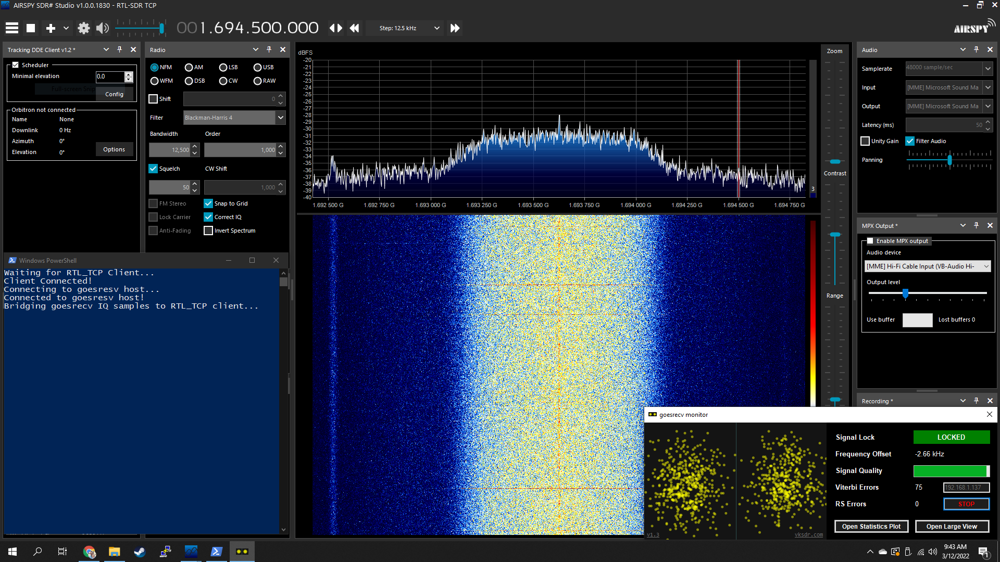
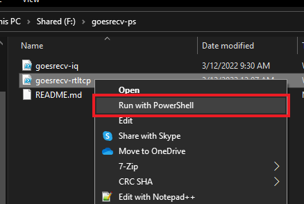
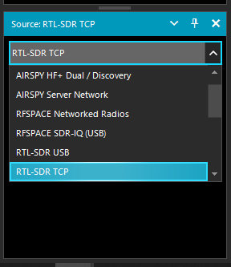
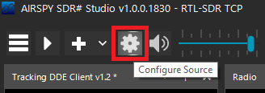
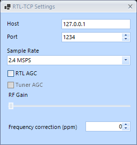
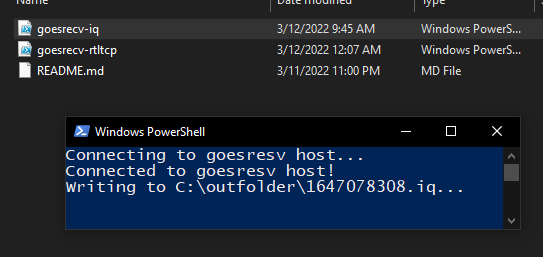
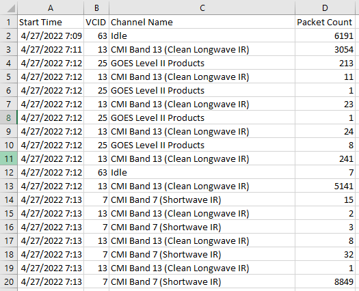

# goesrecv-ps
A collection of PowerShell scripts for doing cool things with pietern's goestools. This repository currently consists of:
 - goesrecv-iq.ps1
 - goesrecv-rtltcp.ps1
 - goesrecv-vcidmon.ps1

More scripts may be added over time. Unless otherwise specified, all scripts are compatible with both PowerShell for Windows (powershell) and PowerShell Core (pwsh). You will likely need to modify your goesrecv.conf file to open the necessary ports. Scroll to the "Recommended goesrecv.conf configuration" section for details.

NOTE: This software is experimental and is for testing and educational purposes only. It leverages what appears to be undocumented parts of goesrecv, so the data may not be 100% accurate. If you see any problems with my code, or potential ways to improve it, let me know!

## goesrecv-rtltcp.ps1
Monitor the RF spectrum of your goestools-dedicated SDR in programs like Gqrx and SDRSharp - all while your goestools stack is still running. This can be useful in troubleshooting your setup without stopping goestools services.

It works by connecting to the RTLSDR/AirSpy sample publisher on goesrecv, and relays the IQ samples as a standard rtl_tcp connection to the SDR client of your choice.



**Basic instructions:**

1. Make sure your goesrecv.conf contains a `[rtlsdr.sample_publisher]` or `[airspy.sample_publisher]` section. Scroll to the "Recommended goesrecv.conf configuration" section for details on that.
2. Edit goesrecv-rtltcp.ps1. At the top, set:
   - `$goesrecvIP` to match the IP of where goesrecv is running (127.0.0.1 if on the same machine as goesrecv)
   - `$goesrecvPort` to match the `[rtlsdr.sample_publisher]` or `[airspy.sample_publisher]` port in goesrecv.conf *(default: 5000)*
   - `$rtltcpPort` to specify the port where rtl_tcp clients (like SDRSharp or Gqrx) will connect *(default: 1234)*
3. Run goesrecv-rtltcp.ps1. On Windows you can right-click on the script and click "Run in PowerShell." On Linux/Mac, you'll need to run `pwsh goesrecv-rtltcp.ps1`

   
5. Connect your SDR software to the IP address and port of goesrecv-rtltcp (127.0.0.1:1234 if on the same machine as goesrecv-rtltcp). This varies by SDR program, but here's the instructions for SDRSharp:
   - Open SDRSharp
   - Change the Source to "RTL-SDR TCP"

     
   - Click the "gear" at the top to configure the source

     
   - Enter the IP address and port of goesrecv-rtltcp, and make sure the sample rate matches the sample rate set in goesrecv.conf. Close the settings window.

     
   - Click the play icon to start monitoring the spectrum
6. When you stop your SDR software, goesrecv-rtltcp will automatically exit. Don't worry, goesrecv itself should still be running, processing data like normal! You will need to launch goesrecv-rtltcp again if you want to monitor the RF spectrum again.

You won't be able to "tune" the SDR with goesrecv-rtltcp. It only lets you "see" the same spectrum that goesrecv sees for troubleshooting purposes. Because of this, your SDR software will not display the correct frequency, gain settings, or even tuner.

While I have not tested it, this should work if you're using an AirSpy or one of the forks of goestools that work with HackRF, SoapySDR, and others.

The recommended setup is to run goesrecv on one machine, then have your SDR application and goesrecv-rtltcp running together on another. You can also have goesrecv and goesrecv-rtltcp running together on one machine, and your SDR application on another. All 3 pieces of software can run on the same machine too - whatever works best for you.

*While you can technically run goesrecv, goesrecv-rtltcp, and your SDR applications on 3 separate machines, this is not recommended due to the network requirements necessary to handle that much traffic.*

## goesrecv-iq.ps1
Record IQ samples from your goestools-dedicated SDR to a file. You can play this baseband file back in the SDR software of your choice.



**Basic instructions:**

1. Make sure your goesrecv.conf contains a `[rtlsdr.sample_publisher]` or `[airspy.sample_publisher]` section. Scroll to the "Recommended goesrecv.conf configuration" section for details on that.
2. Edit goesrecv-iq.ps1. At the top, set:
   - `$goesrecvIP` to match the IP of where goesrecv is running (127.0.0.1 if on the same machine as goesrecv)
   - `$goesrecvPort` to match the `[rtlsdr.sample_publisher]` or `[airspy.sample_publisher]` port in goesrecv.conf *(default: 5000)*
   - `$outfile` to specify a folder to save the IQ file(s) to
   - `$maxSize` to specify the maximum size (in bytes) of an IQ file. Once the max is reached, a new file is created. No samples should be lost in this process. Set to 0 for an IQ recording of infinite length *(Default: 2136997888)*
3. Run goesrecv-iq.ps1. On Windows you can right-click on the script and click "Run in PowerShell." On Linux/Mac, you'll need to run `pwsh goesrecv-iq.ps1`
4. When you're done recording, close the script. You can now play back the baseband recording by opening it in a compatible program. You can also use iqtosharp (https://github.com/Marcin648/iqToSharp) to convert it into a SDRSharp-compatible baseband recording.

As a side note, you can also just use nanocat (https://nanomsg.org/v1.1.5/nanocat.html) to save IQ files to disk from goesrecv. Here's the syntax for that:
```bash
#Substitute the IP address if necessary
nanocat --sub --connect tcp://127.0.0.1:5000 --raw > sdr.bin
```

## goesrecv-vcidmon.ps1
Monitors the current Virtual Channel ID (VCID) being broadcast, and counts the number of contiguous packets in each run. This is useful to identify when the satellite is idle so you can schedule system maintenance and reboots - all while missing as little data as possible.



**Basic instructions:**

1. Make sure your goesrecv.conf contains a `[decoder.packet_publisher]` section - which it will if you're using goesproc or goeslrit. Scroll to the "Recommended goesrecv.conf configuration" section for details on that.
2. Edit goesrecv-vcidmon.ps1. At the top, set:
   - `$ip` to match the IP of where goesrecv is running (127.0.0.1 if on the same machine as goesrecv)
   - `$port` to match the `[decoder.packet_publisher]` port in goesrecv.conf *(default: 5004)*
   - `$ignoreEmwinDcs` to $true to ignore EMWIN/DCS packets, or $false to dump all packets *(default: $true)*
   - `$logfile` can be commented out to disable, or set to a path for creating a CSV log file

3. Run goesrecv-vcidmon.ps1. On Windows you can right-click on the script and click "Run in PowerShell." On Linux/Mac, you'll need to run `pwsh goesrecv-vcidmon.ps1`. 
4. When you're done monitoring, close the script.

This information is also displayed by goesproc when you're running it in an interactive shell, but goesrecv-vcidmon makes logging and remote monitoring much easier.

## Recommended goesrecv.conf configuration
You can have more sections to your conf file than this, and the SDR-specific settings will differ based on the SDR you're using. I have several sections enabled for goesrecv-monitor (https://github.com/sam210723/goesrecv-monitor), as well as graphite/statsd (https://hub.docker.com/r/graphiteapp/graphite-statsd/).
```ini
# Change rtlsdr to airspy if you're using an AirSpy, etc.
[demodulator]
mode = "hrit"
source = "rtlsdr" 

# Change rtlsdr to airspy if you're using an AirSpy, etc.
# Other settings may vary based on your setup
[rtlsdr]
frequency = 1694100000
sample_rate = 2400000
gain = 5

# Change rtlsdr to airspy if you're using an AirSpy, etc.
# Publishes IQ samples coming straight from the SDR over
# nanomsg
[rtlsdr.sample_publisher]
bind = "tcp://0.0.0.0:5000"
send_buffer = 2097152

[costas]
max_deviation = 200e3

# Used by goesrecv-monitor to render constellation diagram
[clock_recovery.sample_publisher]
bind = "tcp://0.0.0.0:5002"
send_buffer = 2097152

# Used to pass data to goesproc, goeslrit, etc
[decoder.packet_publisher]
bind = "tcp://0.0.0.0:5004"
send_buffer = 1048576

# Used by goesrecv-monitor for statistics
[demodulator.stats_publisher]
bind = "tcp://0.0.0.0:6001"

# Used by goesrecv-monitor for statistics
[decoder.stats_publisher]
bind = "tcp://0.0.0.0:6002"

# Used by graphite/statsd
[monitor]
statsd_address = "udp4://localhost:8125"
```
